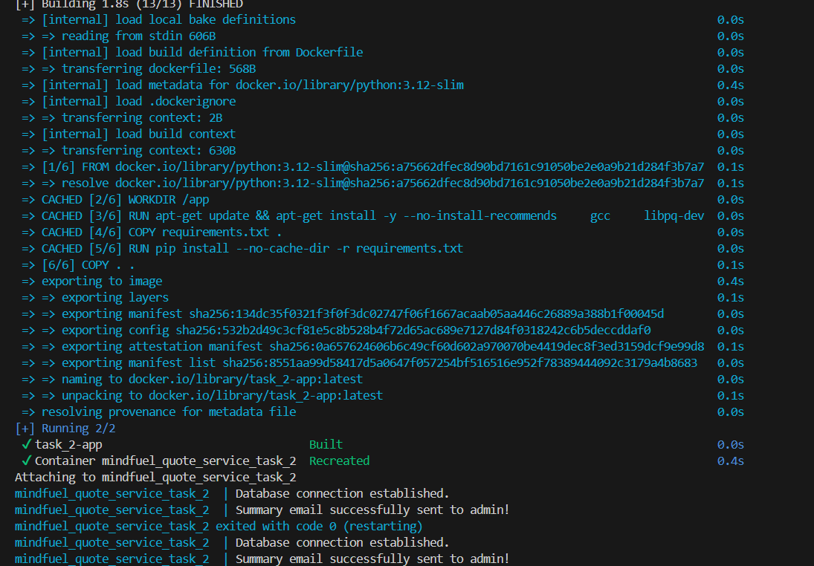

## 📦 Multi-Container Python App with Docker Compose

This project demonstrates a simple multi-container setup using Docker Compose.
It runs a Python application alongside a PostgreSQL database.
The app fetches quotes, stores/reads data from the database, and sends emails successfully when the stack is running.

### 🗂 Project Structure
```
task_2/
├── app/
│   ├── main.py
│   ├── requirements.txt
│   └── Dockerfile
│
├── .gitignore
├── docker-compose.yaml
├── .env
└── doc.md
```

### ⚙️ Services
**App**
* Python application
* Built using a Dockerfile
* Connects automatically to the database container <br>

**Database**
* PostgreSQL
* Uses a persistent Docker volume for data storage

### 🔐 Environment Variables
All configuration values and secrets (database credentials, database host and port, and email configuration) are stored in a ```.env``` file. This file is loaded into the containers using env_file.

### 🚀 How to Run
From the project root directory:
```
docker compose up --build
```
This command will:
* Build the Python app image
* Start the database container
* Start the app container
* Connect the app to the database automatically <br>



### ✅ Verification
When the stack starts successfully:
* Both containers run without errors
* The app connects to the database
* Quotes are fetched correctly
* Emails are sent successfully
You can check logs with:
```
docker compose logs -f
```


### 🧹 Stopping the Stack
```
docker compose down
```
Database data remains safe because it is stored in a Docker volume.